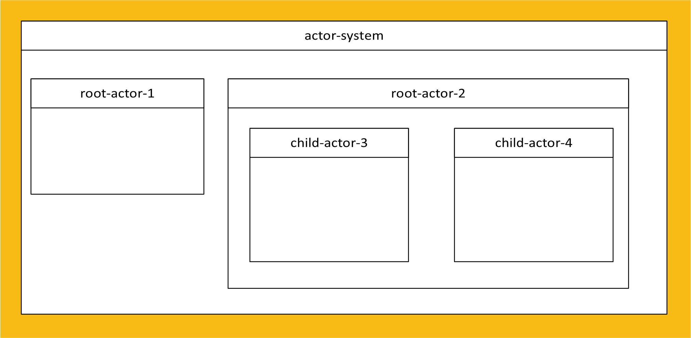
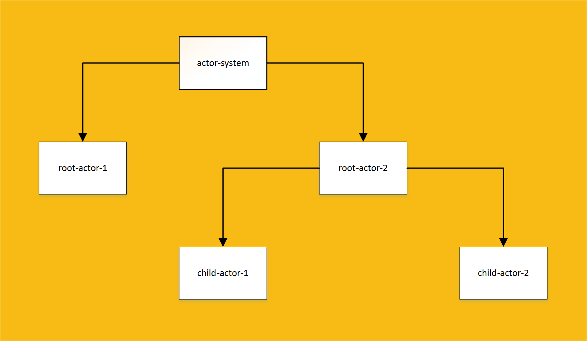
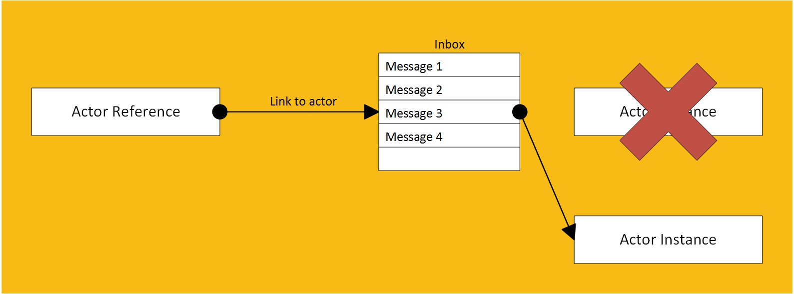

# You can do it


# Put your Akka into it

---

# Akka is an implementation of the "actor model" on .NET

<aside class="notes">

- Port of the Scala Akka framework
- Open source project, Petabridge is one of the main contributors

</aside>

---

# What is the actor model?

- It is a way of structuring your app
- Instead of classes calling each other directly, they communicate via **messages** via a framework
- Classes that communicate in this manner are called **Actors**

<aside class="notes">

- Process one message at a time
- When processing a message an actor can directly modify its own internal private state, but not the state of other actors

</aside>

---

# Why use an actor model?

- Actors are **thread safe**
- Actors are **asynchronous**
- Actor frameworks tend to have great mechanisms for **error handling**
- Actors promote **scalable** and more loosely coupled systems

<aside class="notes">
  
- Actors allow for a very high through-put

</aside>

---

# How the actor model relates to traditional code

- Think of an actor as a function and the message as its parameters
- What the function does depends on the type of message it receives
- When an actor sends a message to another actor, think of this as one function calling another

<aside class="notes">

- The application is a factory
- Actors are workers inside factory
- Messages are jobs that need doing inside the factory

</aside>

---

# Actor hierarchy

- An actor can create other actors
  - The newly created actor is called the **child** actor
  - The actor that created it is called the **parent** actor

---

# Actor hierarchy



---

# Actor hierarchy



<aside class="notes">

- This tree structure is great for error handling
- Actors can talk to siblings having actor refs passed to them in messages

</aside>

---

# Error handling in actor hierarchies

- When an actor's child throws an unhandled exception it must decide what to do. It has three options:
  - Restart all its child actors
  - Just restart the failing child actor
  - Escalate the error to its parent actor, who in turn has to the same three options

---

# How are actors used?

You never instantiate an actor directly, you only ever hold a reference to it


<aside class="notes">

- Processing one message at a time makes actors thread safe.
- Since you only have a reference you cannot access or modify the internal state of an actor.
- Since you only have a reference the only way to interact with the actor is to send it a message.

</aside>

---

# How are actors used?

The actor reference is updated when an actor restarts due to an error



---

# Starting your first actor

If actors create other actors, how do I crete my first actor?

---

# Actor System

``` csharp
using System;
using Akka.Actor;

namespace AkkaExamples
{
  internal class Program
  {
    private static ActorSystem _system;

    private static void Main(string[] args)
    {
      _system = ActorSystem.Create("example-name");
      Console.CancelKeyPress += (sender, eventArgs) =>
      {
        eventArgs.Cancel = true; // Cancelling the event prevents the process terminating too early
        _system.Terminate();
      };
      _system.WhenTerminated.Wait();
    }
  }
}
```

<aside class="notes">

- One actor system per app
- Entry point to the actor system
- Systems talk to each other over a network, name is used for routing
- Do not used system constructor, most Akka classes have a “Create” instantiation method.

</aside>

---

# Actors in the Actor System

- Actors created directly inside the Actor System are called **Root Actors** as they do not have a parent
- You can have multiple root actors

<aside class="notes">

- Imagine a tree with multiple root nodes (making it multiple trees)

</aside>

---

# Instantiating Actors

- Instantiating/starting an actor in Akka can be done in one of two places:
  - In the ActorSystem (for creating *root* actors)
  - Inside Actors (for creating *child* actors)
- Both places expose the same function to achieve this

---

# Actor Of

``` csharp
using System;
using Akka.Actor;

namespace AkkaExamples
{
  internal class Program
  {
    private static ActorSystem _system;

    private static void Main(string[] args)
    {
      _system = ActorSystem.Create("example-name");
      Console.CancelKeyPress += (sender, eventArgs) =>
      {
        eventArgs.Cancel = true;
        _system.Terminate();
      };

      //Create root actor
      IActorRef rootActor = _system.ActorOf(Props.Create(() => new ExampleRootActor()), "example-root-actor-name");

      _system.WhenTerminated.Wait();
    }
  }
}
```

<aside class="notes">

- IActorRef
  - Is returned not actor type
  - Allows no access to internal state regardless of whether its public
  - Forces us to follow actor model correctly
  - When a failing actor restarts the reference is updated
    
- Props
  - Takes an expression on how to create Actor
  - Akka uses the expression to create actor
  - Used it to create new instances after failure
  - Hence why its an expression and not an instance of the actor object

- Name
  - Used for routing
  - Optional (unlike system)
  - A GUID is used if one isn't given
  - Should be meaningful
  - No child of the same actor can have the same name

</aside>

---

# Sending Messages

``` csharp
public class ExampleMessage
{
  public ExampleMessage(string exampleData)
  {
    ExampleData = exampleData;
  }

  public string ExampleData {get; }
}
```

``` csharp
IActorRef rootActor = _system.ActorOf(Props.Create(() => new ExampleRootActor()), "example-root-actor-name");

//Send message to root actor via actor ref
rootActor.Tell(new ExampleMessage("Example message information"));
```

<aside class="notes">

- Messages are
  - Simple POCO classes
  - Immutable
  - Serialisable
  - Small (if large pass a handle)
- Tell is fire-and-forget, does not block thread, wait for response

</aside>

---

# Writing your own Actor

``` csharp
public class ExampleRootActor : ReceiveActor
{
  public ExampleRootActor()
  {
    // Run the following lambda when a message is sent to this actor of type ExampleMessage
    Receive<ExampleMessage>(m => ReceiveExampleMessage(m));
  }

  private void ReceiveExampleMessage(ExampleMessage exampleMessage)
  {
    Console.WriteLine(exampleMessage.ExampleData);
  }

  public class ExampleMessage
  {
    public ExampleMessage(string exampleData)
    {
      ExampleData = exampleData;
    }

    public string ExampleData {get; }
  }
}
```

<aside class="notes">

- Inherit from ActorBase class
- Different classes are available for different extensions
- Give the actor a lambda to call for each type it receives (I'll call them receive callbacks)
- Private methods for each message type
- Ignore messages that have no callbacks
- First matching receive callback wins by default
- The receive actor is like Akka's method of pattern matching

</aside>

---

# Child Actors

``` csharp
public class ExampleRootActor : ReceiveActor
{
  private readonly IActorRef _exampleActorRef;

  public ExampleRootActor()
  {
    // Create child actor
    _exampleActorRef = Context.ActorOf(Props.Create(() => new ExampleChildActor()), "example-child-actor");
    // Send child actor a message
    _exampleActorRef.Tell(new ExampleMessage("Example message information"));
  }
}
```
<aside class="notes">

- Context exposes same Actor Of method as system
- Context is populated by ActorOf method
- Another reason why actor handles the actual newing up for us

</aside>

---

# Sending messages to parent
          
``` csharp
public class ExampleChildActor : ReceiveActor
{
  public ExampleChildActor()
  {
    Receive<ExampleMessage>(m => ReceiveExampleMessage(m));
  }

  private void ReceiveExampleMessage(ExampleMessage exampleMessage)
  {
    // Process message
    Console.WriteLine(exampleMessage.ExampleData);

    // Send a new message to parent actor
    Context.Parent.Tell(new ExampleSuccessMessage());
  }

  public class ExampleSuccessMessage { }
}
```

---

# Sending messages to self

``` csharp
public class ExampleSelfTellActor : ReceiveActor
{
  public ExampleSelfTellActor()
  {
    Receive<ExampleMessage>(m => ReceiveExampleMessage(m));
    Receive<ExampleSelfMessage>(m => ReceiveExampleSelfMessage(m));
  }

  private void ReceiveExampleMessage(ExampleMessage exampleMessage)
  {
    // Process message
    Console.WriteLine(exampleMessage.ExampleData);

    // Send a new message to self
    Self.Tell(new ExampleSelfMessage());
  }

  private void ReceiveExampleSelfMessage(ExampleSelfMessage exampleSelfMessage)
  {
    // TODO Process message sent to self here
  }

  public class ExampleMessage
  {
    public ExampleMessage(string exampleData)
    {
      ExampleData = exampleData;
    }

    public string ExampleData {get; }
  }

  private class ExampleSelfMessage { }
}
```
<aside class="notes">
- Puts message at back of queue
- Allows actor to process other messages in the mean time
- Actors don't differentiate between messages sent from other actors or themselves
- Nesting classes inside actors allows them to be private
</aside>

---

# Replying to messages

``` csharp
public class ExampleReplyActor : ReceiveActor
{
  public ExampleReplyActor()
  {
    Receive<ExampleRequestMessage>(m => ReceiveExampleRequestMessage(m));
  }

  private void ReceiveExampleRequestMessage(ExampleRequestMessage exampleMessage)
  {
    // Reply to message
    Context.Sender.Tell(new ExampleResponseMessage($"Successfully replying to message: {exampleMessage.ExampleData}"));
  }

  public class ExampleRequestMessage
  {
    public ExampleRequestMessage(string exampleData)
    {
      ExampleData = exampleData;
    }

    public string ExampleData {get; }
  }

  public class ExampleResponseMessage
  {
    public ExampleResponseMessage(string exampleData)
    {
      ExampleData = exampleData;
    }

    public string ExampleData {get; }
  }
}
```

<aside class="notes">

- Send message to the actor that sent the message to you
- Use Context.Sender

</aside>

---

# Receiving Replies

``` csharp
public class ExampleAskActor : ReceiveActor
{
  private readonly IActorRef _exampleReplyActorRef;

  public ExampleAskActor()
  {
    ReceiveAsync<Start>(ReceiveStartAsync);
    _exampleReplyActorRef = Context.ActorOf(Props.Create(() => new ExampleReplyActor()), "example-reply-actor-name");
  }

  private async Task ReceiveStartAsync(Start start)
  {
    ExampleReplyActor.ExampleResponseMessage result = await _exampleReplyActorRef.Ask<ExampleReplyActor.ExampleResponseMessage>(new ExampleReplyActor.ExampleRequestMessage("Hello, World"));

    // The following will print "Successfully replying to message: Hello, World"
    Console.WriteLine(result.ExampleData);
  }

  public class Start { }
}
```

<aside class="notes">

- Aks method creates a task that resolves when message of requested type is replied
- Note use of ReceiveAsync
- Don't have to use ask, you can receive replied messages just like any other message

</aside>

---

# Behaviours

``` csharp
public class ExampleBehaviorActor : ReceiveActor
{
  public ExampleBehaviorActor()
  {
    Become(Starting);
  }

  private void Starting()
  {
    Receive<ExampleMessageType1>(m => ReceiveExampleMessageType1(m));
  }

  private void Started()
  {
    Receive<ExampleMessageType2>(m => ReceiveExampleMessageType2(m));
  }

  private void ReceiveExampleMessageType1(ExampleMessageType1 exampleMessage)
  {
    //TODO: do something with first message type that would make actor ready for second message type
    Become(Started);
  }
  
  private void ReceiveExampleMessageType2(ExampleMessageType2 exampleMessage)
  {
    //TODO: do something with second message type
  }

  public class ExampleMessageType1 { }

  public class ExampleMessageType2 { }
}
```

<aside class="notes">

- Change receive callbacks at run time
- Use Become method
- Note that receive callbacks are not carried over to new behaviours

</aside>

---

# Stashing

``` csharp
public class ExampleStashActor : ReceiveActor, IWithUnboundedStash
{
  public IStash Stash {get; set; } // Property to implement IWithUnboundedStash

  public ExampleStashActor()
  {
    Become(Starting);
  }

  private void Starting()
  {
    Receive<ExampleMessageType1>(m => ReceiveExampleMessageType1(m));
    Receive<ExampleMessageType2>(m => Stash.Stash()); // Stash ExampleMessageType2 when starting
  }

  private void Started()
  {
    Receive<ExampleMessageType2>(m => ReceiveExampleMessageType2(m));
    Stash.UnstashAll(); // Unstash stashed messages when started
  }

  private void ReceiveExampleMessageType1(ExampleMessageType1 exampleMessage)
  {
    //TODO: do something with first message type that would make actor ready for second message type
    Become(Started);
  }
  
  private void ReceiveExampleMessageType2(ExampleMessageType2 exampleMessage)
  {
    //TODO: do something with second message type
  }

  public class ExampleMessageType1 { }

  public class ExampleMessageType2 { }
}
```

<aside class="notes">

- Often used with behaviours
- In memory list of messages
- Implement IWithUnboundedStash
- Stash is populated by ActorOf
- Stash method puts current message in stash
- Unstash method keeps message order and places them at the front of the queue

</aside>

---

# PipeTo

``` csharp
public class ExamplePipeToActor : ReceiveActor
{
  private readonly IThingyDoer _thingyDoer;

  public ExamplePipeToActor(IThingyDoer thingyDoer)
  {
    _thingyDoer = thingyDoer;
    Receive<ExampleRequestMessage>(m => ReceiveExampleRequestMessage(m));
    Receive<ExampleResponseMessage>(m => ReceiveExampleResponseMessage(m));
  }

  private void ReceiveExampleRequestMessage(ExampleRequestMessage request)
  {
    _thingyDoer
      .DoAsync(request.ExampleData)
      .ContinueWith(
        task => new ExampleResponseMessage(task.Result),
        TaskContinuationOptions.ExecuteSynchronously)
      .PipeTo(Self);
  }

  private void ReceiveExampleResponseMessage(ExampleResponseMessage response)
  {
    Console.WriteLine(response.ExampleData);
  }

  public class ExampleRequestMessage
  {
    public ExampleRequestMessage(string exampleData)
    {
      ExampleData = exampleData;
    }

    public string ExampleData {get; }
  }

  private class ExampleResponseMessage
  {
    public ExampleResponseMessage(string exampleData)
    {
      ExampleData = exampleData;
    }

    public string ExampleData {get; }
  }
}
```

<aside class="notes">

- PipeTo is good because awaiting a task blocks an actor which is awful for performance
- Note the private class that allows you to scope messages to one actor only

</aside>

---

# Bells & Whistles
          
``` csharp
public class DownloadActor : ReceiveActor, IWithUnboundedStash
{
  private HttpClient _client;

  public DownloadActor()
  {
    Become(Idle);
  }

  public IStash Stash {get; set; }

  protected override void PreStart()
  {
    _client = new HttpClient();
    base.PreStart();
  }

  protected override void PostStop()
  {
    _client.Dispose();
    base.PostStop();
  }

  private void Idle()
  {
    Receive<Download>(start =>
    {
      _client
        .GetAsync(start.Url)
        .PipeTo(
          Self,
          Self,
          httpRes => new DownloadComplete(httpRes.Content),
          exception => new DownloadFailure());
      Become(Downloading);
    });
  }

  private void Downloading()
  {
    ReceiveAsync<DownloadComplete>(async download =>
    {
      string content = await download.Content.ReadAsStringAsync();
      Context.Parent.Tell(new DownloadResult(content));
      Stash.UnstashAll();
      Become(Idle);
    });
    Receive<DownloadFailure>(failure =>
    {
      Context.Parent.Tell(failure);
      Stash.UnstashAll();
      Become(Idle);
    });
    Receive<Download>(start => Stash.Stash());
  }

  public class Download
  {
    public string Url {get; }

    public Download(string url)
    {
      Url = url;
    }
  }

  private class DownloadComplete
  {
    public HttpContent Content {get; }

    public DownloadComplete(HttpContent content)
    {
      Content = content;
    }
  }

  public class DownloadResult
  {
    public string Content {get; }

    public DownloadResult(string content)
    {
      Content = content;
    }
  }

  public class DownloadFailure { }
}
```
